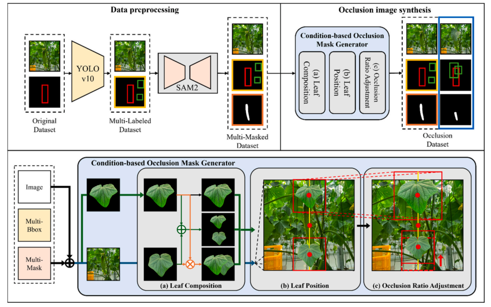
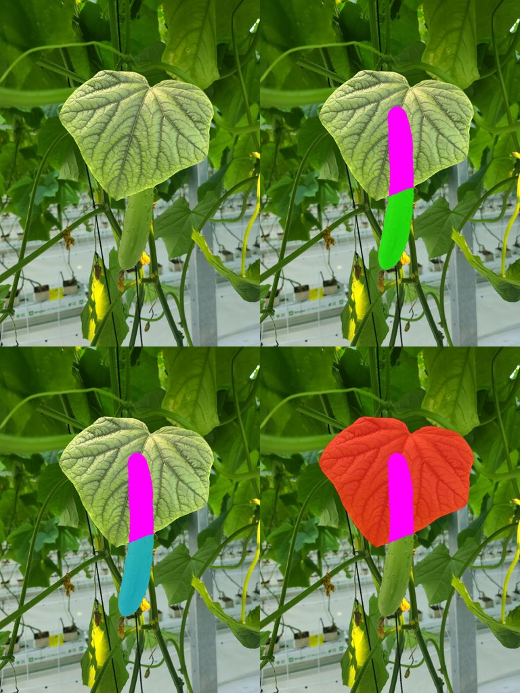
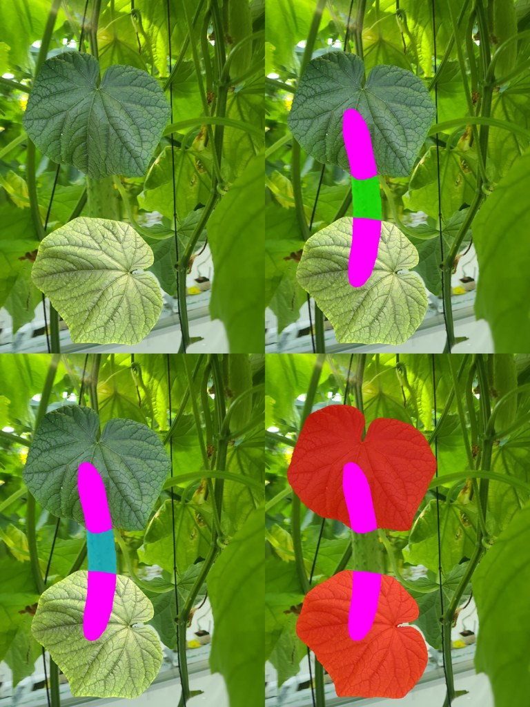
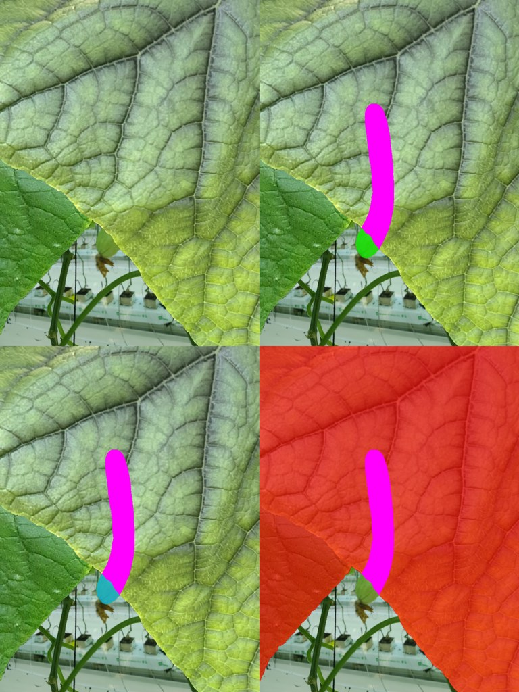

# Condition-based Synthetic Dataset for Amodal Segmentation of Occluded Cucumbers in Agricultural Images

#### Computers and Electronics in Agriculture 2025 [Paper](https://www.sciencedirect.com/science/article/pii/S0168169925009068) · [BibTeX](assets/cucumber_bibTex.bib)

<a href="https://scholar.google.co.kr/citations?user=i4nJgtEAAAAJ&hl=ko&oi=sra">Jin-Ho Son</a><sup>1</sup>*,
<a href="https://hojunking.github.io/webpages/hojunsong/">Hojun Song</a><sup>2</sup>,
<a href="https://scholar.google.co.kr/citations?user=m-NwAdUAAAAJ&hl=ko&oi=sra">Chae-yeong Song</a><sup>2</sup>,
<a href="https://scholar.google.co.kr/citations?user=QzuLLbcAAAAJ&hl=ko&oi=sra">Minse Ha</a><sup>2</sup>,
<a href="https://scholar.google.com/citations?user=mN32nwQAAAAJ&hl=ko">Dabin Kang</a><sup>2</sup>,
and <a href="https://scholar.google.co.kr/citations?user=n5RWOaMAAAAJ&hl=ko&oi=sra">Yu-Shin Ha</a><sup>1,3†</sup>

\* Equal contribution  
† Corresponding author

<sup>1</sup>Department of Bio-Industrial Mechanical Engineering, Kyungpook National University (KNU)  
<sup>2</sup>School of Computer Science and Engineering, Kyungpook National University (KNU)  
<sup>3</sup>Upland Field Machinery Research Center, Kyungpook National University (KNU)

<p align="center">
  
</p>

This repository provides a reproducible implementation of the paper's
condition-based synthetic dataset framework. It controls leaf composition,
position, occlusion ratio, and gamma augmentation, then exports amodal and
visible annotations suitable for AISFormer integration.

## Release Status

- [x] Prepared cucumber bbox and leaf-cutout input path
- [x] SAM2 cucumber mask generation
- [x] Configurable paper-condition synthesis and AISFormer-compatible export
- [ ] AISFormer training and evaluation

## Quick Start

### Conda

```bash
./scripts/setup_omg.sh
conda activate OMG
./scripts/download_sam2_checkpoint.sh
```

```bash
./scripts/run_quickstart.sh
```

### Docker

```bash
docker build -t omg .
# Omit "--gpus all" on CPU-only machines.
docker run --gpus all --rm -it \
  -v "$PWD/checkpoints:/workspace/occlusion-mask-generation/checkpoints" \
  -v "$PWD/sample_data:/workspace/occlusion-mask-generation/sample_data" \
  -v "$PWD/outputs:/workspace/occlusion-mask-generation/outputs" \
  omg
```

Inside the container:

```bash
./scripts/download_sam2_checkpoint.sh
./scripts/run_quickstart.sh
```

The command prepares or validates the three sample scenes, generates cucumber
masks with SAM2, synthesizes representative paper conditions, and validates
the result. Review:

- `sample_data/quickstart/previews/`: input previews
- `outputs/quickstart/stage2/previews/`: SAM2 mask previews
- `outputs/quickstart/synthesis/previews/`: condition layout previews
- `outputs/quickstart/synthesis/annotations/instances.json`: final export

Project-specific YOLO weights are not distributed because their source
training dataset cannot be redistributed. The quickstart therefore starts
from supplied cucumber bboxes and RGBA leaf cutouts.

## Configurable Synthesis

Use a preset directly:

```bash
# --overwrite replaces an existing generated output directory.
python pipeline.py synthesize \
  --config configs/quickstart.json \
  --overwrite
```

`configs/quickstart.json` creates a small representative result.
`configs/paper-full.json` evaluates the full condition/ratio grid.
`configs/paper-weighted.json` creates an exact `5:4:1` ratio distribution for
Conditions 1-3. A copied config can select conditions and tune ratios, gamma
values, output size, tolerance, top/bottom positions, leaf-size search ranges,
separation, and attachment overlap.

Example layout previews:

<p align="center">
  
  
  
</p>

Related docs:

- `docs/configuration.md`: synthesis presets and tunable condition parameters
- `docs/pipeline.md`: three-stage pipeline contract
- `docs/leaf_cutouts.md`: YOLO + SAM2 guide for preparing RGBA leaf assets

## Paper Conditions

- Baseline: one centered leaf at fixed `50%` occlusion
- Condition 1: one enlarged leaf at the top or bottom
- Condition 2: two separate leaves at the top and bottom
- Condition 3: two attached leaves at the top or bottom
- Occlusion ratios: `50%`, `75%`, `90%`
- Paper target distribution for large-scale generation: `5:4:1`
- Gamma values: `0.3`, `1.0`, `3.0`

## Citation

```bibtex
@article{SON2025110800,
  title = {Condition-based synthetic dataset for amodal segmentation of occluded cucumbers in agricultural images},
  journal = {Computers and Electronics in Agriculture},
  volume = {238},
  pages = {110800},
  year = {2025},
  doi = {https://doi.org/10.1016/j.compag.2025.110800},
  author = {Jin-Ho Son and Hojun Song and Chae-yeong Song and Minse Ha and Dabin Kang and Yu-Shin Ha}
}
```

## Acknowledgement

This work was supported by the National Research Foundation of Korea (NRF)
under the BK21 FOUR program. This research was also conducted as part of the
[2024 BK21 Graduate Student Interdisciplinary Community Project](https://www.knu.ac.kr/wbbs/wbbs/bbs/btin/viewBtin.action?bbs_cde=1&btin.bbs_cde=1&btin.doc_no=1331701&btin.appl_no=000000&menu_idx=67),
under the team **“Deep Learning-based Automatic Cucumber Harvesting Robot
Research”**, led by [Hojun Song](https://hojunking.github.io/webpages/hojunsong/).

The work builds on [YOLOv10](https://github.com/THU-MIG/yolov10),
[SAM2](https://github.com/facebookresearch/sam2), and
[AISFormer](https://github.com/UARK-AICV/AISFormer).
